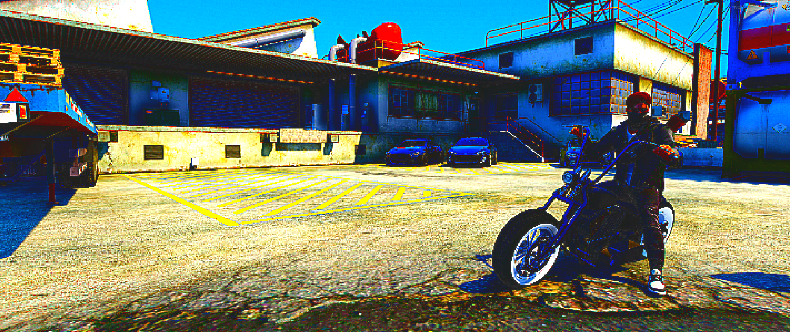

## Bear Pog

This is the best most epic reshade shader out there.

### Installation

1. Simply download the [BearPog.fx](BearPog.fx) file and place it in your Reshade Shaders folder
2. Yeah thats it mate

Btw, check out my other shaders [here](https://sh.coalaura.org/)!

### Usage

There aren't much customization options, but after toggling the shader on you can adjust the settings in the reshade UI.

### Screenshots

